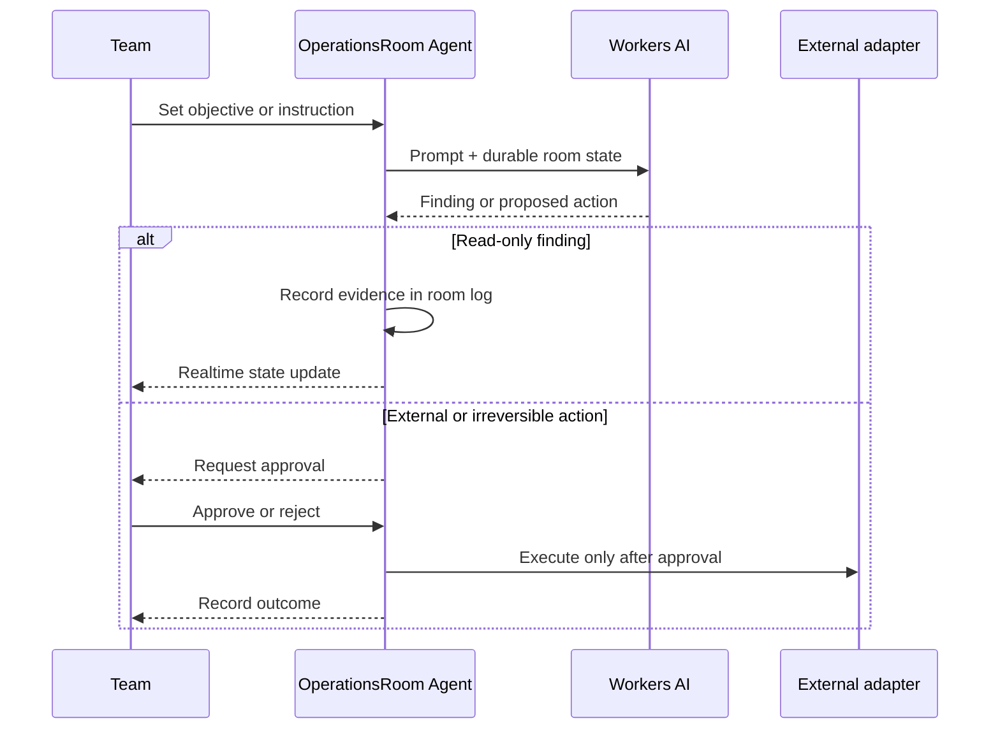

# Relay Room

**A multiplayer operations room where people supervise AI work together.**

Relay Room turns a private agent conversation into a shared operational surface: one objective, a visible controller, a live decision queue, explicit approval gates, and a durable record of what the agent observed and what people authorized.

> Status: functional MVP. Room state, realtime synchronization, AI streaming, pause/resume, control handoff, human approval, and the decision log are implemented. Third-party write actions are intentionally represented by a safe reference adapter rather than production credentials.

## Why this product

Most AI interfaces are single-player chats. That breaks down when an agent works on a release, support incident, campaign, customer escalation, or any task where several people share responsibility.

Relay Room is designed around the missing coordination layer:

- everyone sees the same current objective and state;
- the agent may investigate without interrupting the team;
- consequential actions stop at an explicit approval boundary;
- one person holds decision control at a time;
- findings, instructions, approvals, and rejections remain visible;
- reconnecting does not erase the room or its operational context.

## Product surface

| Surface           | Purpose                                                                       |
| ----------------- | ----------------------------------------------------------------------------- |
| Operation context | Objective, room phase, controller, participants, unresolved decisions         |
| Agent workspace   | Shared streaming conversation with evidence and tool execution state          |
| Decision queue    | Approve, reject, or complete proposed actions without searching chat history  |
| Room log          | Compact audit trail for findings, human decisions, control changes, and notes |
| Memory input      | Add durable constraints and decisions outside the conversational stream       |

## Interaction model



## Architecture

Each room maps to one Cloudflare Agent instance. This is the coordination boundary: clients that join the same named room share state and WebSocket updates, while separate rooms remain isolated.

```text
React clients
    │
    ├── realtime state and typed RPC
    ├── streaming AI messages
    └── approval responses
            │
            ▼
Cloudflare OperationsRoom Agent
    ├── SQLite-backed room state
    ├── durable chat history
    ├── controller and phase transitions
    ├── audit events
    └── human-in-the-loop tools
            │
            ▼
Workers AI + approved external adapters
```

### State is a product contract

The room does not derive operational truth by scraping message text. Decisions and controls use structured state:

```ts
export interface RoomState {
  title: string;
  objective: string;
  phase: "ready" | "running" | "waiting_approval" | "paused" | "completed";
  controller: string;
  members: RoomMember[];
  actions: RoomAction[];
  events: RoomEvent[];
}
```

That makes the interface predictable, testable, and suitable for notification or reporting adapters later.

### Approval is enforced at tool execution

The model cannot bypass the confirmation UI by phrasing an action differently. Actions with outside effects are exposed through a tool configured with `needsApproval`:

```ts
requestExternalAction: tool({
  description: "Request approval before an external or irreversible action",
  inputSchema: externalActionSchema,
  needsApproval: true,
  execute: async (input) => executeApprovedAction(input)
});
```

The MVP adapter records the approved intent and deliberately does not hold production credentials. A real integration can replace the adapter without weakening the approval boundary.

### Transition rules stay outside the UI

Room actions are domain functions. For example, an action cannot become `done` before it becomes `approved`, and a completed room cannot silently resume. These rules are tested independently from React and Cloudflare bindings.

## Implemented capabilities

- Cloudflare Agents SDK with one persistent agent per named room
- realtime state synchronization over WebSockets
- Workers AI streaming conversation
- explicit controller handoff
- pause and resume controls
- structured action queue with risk levels
- approval, rejection, and completion transitions
- server-enforced approval for external AI tool calls
- bounded room event history
- reconnectable chat recovery
- responsive desktop and mobile operations UI
- deterministic unit tests for room-state invariants
- formatting, linting, TypeScript, tests, and Semgrep in CI

## Local development

The application uses Workers AI through a remote Cloudflare binding. Authenticate Wrangler before starting it locally.

```bash
npm install
npx wrangler login
npm run dev
```

Open `http://localhost:5173`.

Verification:

```bash
npm run check
npm test
```

## Repository map

| Path               | Responsibility                                               |
| ------------------ | ------------------------------------------------------------ |
| `src/server.ts`    | Agent runtime, AI prompt, RPC controls, approval-gated tools |
| `src/room.ts`      | Domain types and room-state transitions                      |
| `src/room.test.ts` | Approval, lifecycle, and bounded-history invariants          |
| `src/app.tsx`      | Shared room interface and realtime interactions              |
| `src/styles.css`   | Responsive operations-focused visual system                  |
| `wrangler.jsonc`   | Worker, AI binding, Durable Object migration, static assets  |

## Safety and scope

This public repository contains no customer data, private prompts, API keys, production destinations, or proprietary connectors. It demonstrates the collaboration and control model with a safe external-action adapter. Secrets belong in Cloudflare bindings, and authentication must be added before using rooms with sensitive data.

## Next product milestones

1. Identity and organization membership through Cloudflare Access or an auth provider.
2. Shareable room links with owner, editor, approver, and observer roles.
3. GitHub, Slack, email, and ticketing adapters behind the same approval contract.
4. Durable multi-step workflows that survive long pauses and deployments.
5. Notifications when a room needs a decision or an agent reaches a blocker.
6. Searchable evidence and post-operation summaries.
7. Stripe team plans with room, retention, and integration limits.

## License

[MIT](LICENSE)

---

Built by [0xENTYPER](https://github.com/0xENTYPER).
